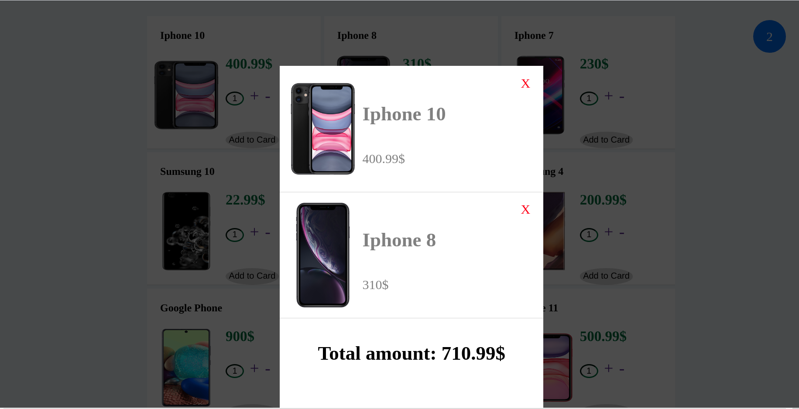

# _StoringDataInSessionStoarge_

#### _Version 1_
#### _Date 10/07/2020_
#### By _**Adilet Momunaliev**_

## Description

_StoringDataInSessionStoarge is design to show list of products and add product with properties and total amount in shopping card and sessionStorage._

## Getting Started

These instructions will get you a copy of the project up and running on your local machine for development and testing purposes.

### Instruction

* Node js in your local machine
* git clone
* npm install
* npm run start
### Specifications
 ;
## Technologies Used

_HTML, CSS, JavaScript, DOM Elements and Methods,session Storage , IDE Atom_

### License

*_Copyright (c) 2020 **Adilet Momunaliev**_*
