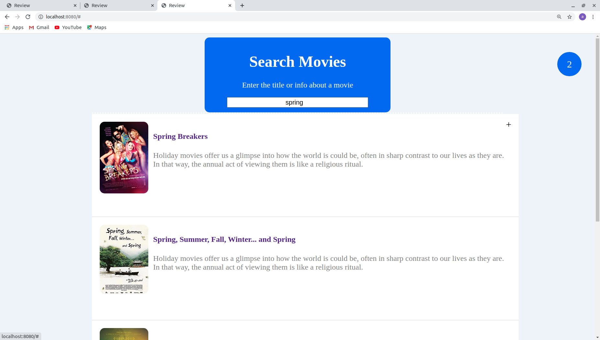

# _AutocompleteSearchAndStoreInLocalStorage_

#### _Version 1_
#### _Date 10/30/2020_
#### By _**Adilet Momunaliev**_

## Description

_AutocompleteSearch and Store chosen movie in local storage.In addition, number of chosen movies are shown as a shopping card._

## Getting Started

These instructions will get you a copy of the project up and running on your local machine for development and testing purposes.

### Instruction

* Node js in your local machine
* git clone
* npm install
* npm run start
### Specifications
 ;
## Technologies Used

_HTML, CSS, JavaScript, DOM Elements and Methods,Async functions,Local Storage, IDE Atom_

### License

*_Copyright (c) 2020 **Adilet Momunaliev**_*
